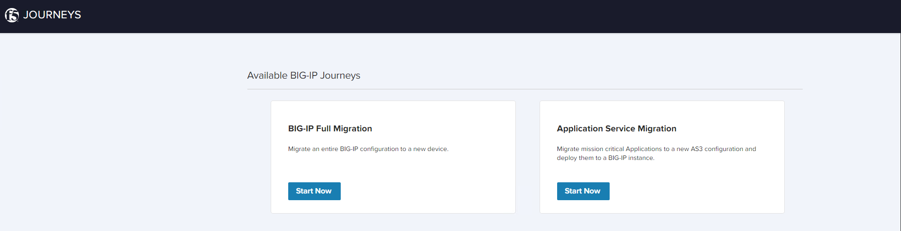

> ** Note: This repo is not maintained nor supported by F5**

# f5-journeys installation using vanila kubernetes 

- [Description](#description)
- [iSCSI services check](#iscsi-services-check-for-ubuntu)
- [iSCSI services installation](#iscsi-services-installation-for-ubuntu)
- [OpenEBS storage class services installation](#openebs-storage-class-services-installation-for-ubuntu)
- [Kompose services installation](#kompose-services-installation-for-ubuntu)
- [f5-journeys modified installation](#f5-journeys-modified-installation)


## Description
JOURNEYS is an application designed to assist F5 Customers with migrating a BIG-IP configuration to a new F5 device and enable new ways of migrating.

Supported journeys:

Full Config migration - migrating a BIG-IP configuration from any version starting at 11.5.0 to a higher one, including VELOS and rSeries systems.
Application Service migration - migrating mission critical Applications and their dependencies to a new AS3 configuration and deploying it to a BIG-IP instance of choice. More details can be found at https://github.com/f5devcentral/f5-journeys#description

To start our installation let's make sure all the pre-requisits are in place first not only from a journeys's perspective but also in the k8s cluster itself. This repo assumes that you are using Ubuntu as the linux operating system even though references to other flavor have been made available.

## iSCSI services check for ubuntu

1) Verify iSCSI services are configured for Ubuntu. If iSCSI initiator is already installed on your node, check that the initiator name is configured and iSCSI service is running using the following commands.

```
sudo cat /etc/iscsi/initiatorname.iscsi
systemctl status iscsid 
```

If the service status is shown as Inactive , then you may have to enable and start iscsid service using the following command.

```
sudo systemctl enable --now iscsid
```
```
systemctl status iscsid
```
> Note: The following output is the expected.
```
● iscsid.service - iSCSI initiator daemon (iscsid)
   Loaded: loaded (/lib/systemd/system/iscsid.service; disabled; vendor preset: enabled)
   Active: **active** (running) since Mon 2019-02-18 11:00:07 UTC; 1min 51s ago
     Docs: man:iscsid(8)
  Process: 11185 ExecStart=/sbin/iscsid (code=exited, status=0/SUCCESS)
  Process: 11170 ExecStartPre=/lib/open-iscsi/startup-checks.sh (code=exited, status=0/SUCCESS)
 Main PID: 11187 (iscsid)
    Tasks: 2 (limit: 4915)
   CGroup: /system.slice/iscsid.service
           ├─11186 /sbin/iscsid
           └─11187 /sbin/iscsid
```

## iSCSI services installation for ubuntu
2) Installing iSCSI tools - If iSCSI initiator is not installed on your node, install open-iscsi packages using the following commands.

```
sudo apt-get update
sudo apt-get install open-iscsi
sudo systemctl enable --now iscsid
```

## OpenEBS storage class services installation for ubuntu
3) install openebs for ubuntu in order to define your storageclass. 

```
kubectl apply -f https://openebs.github.io/charts/openebs-operator.yaml
```

   to make it a default storageclass in your cluster issue the following command

```
oc patch storageclass openebs-hostpath -p '{"metadata": {"annotations":{"storageclass.kubernetes.io/is-default-class":"true"}}}'
```

   to confirm your changes issue the following command 

```
oc get storageclass -n openebs
```

4) apply the yaml file for the pvc storage class referenced for the pvc local-hostpath-pvc.yaml available as a reference at https://openebs.io/docs/user-guides/localpv-hostpath. the repo has this file already modified with all it is needed.

```
oc apply -f local-hostpath-pvc.yaml
```

***Note: This is already done in the /config files already. This is just a walk through of what I did in order to get the docker files from f5 journeys tool fully converted to kubernetes. I had to download the f5-journeys repo from github located at https://github.com/f5devcentral/f5-journeys.git and then edit the journeys default deployment yaml file to included the following specs from the example app on item number 4 above. Prerequesites for your linux platform are available in more details at https://openebs.io/docs/user-guides/prerequisites*** you can skip to step 6.

```
spec:
  volumes:
  - name: local-storage
    persistentVolumeClaim:
      claimName: local-hostpath-pvc
```

## Kompose services installation
5) install kompose via a deb package that is released for compose. Download latest package in the assets in github releases.

```
wget https://github.com/kubernetes/kompose/releases/download/v1.26.1/kompose_1.26.1_amd64.deb # Replace 1.26.1 with latest tag
sudo apt install ./kompose_1.26.1_amd64.deb
```

6) convert the docker container files into kubernetes compliant yaml files using Kompose

```
cd f5-journeys/config
#kompose convert -f docker-compose.yaml
kubectl apply -f celery-worker-deployment.yaml acc-api-deployment.yaml journeys-deployment.yaml journeys-service.yaml local-hostpath-pvc.yaml postgres-claim0-persistentvolumeclaim.yaml postgres-deployment.yaml redis-deployment.yaml redis-service.yaml postgres-claim0-persistentvolumeclaim.yaml
kubectl get po
```

## f5-journeys modified installation 
7) After applying the yaml files inside the config directory pleaes check for the pods' statuses and their respectively services (listeners)
```

kubect get pods -A
kubect get svc 
```

To validate journeys is up and running access the application using the ip address added in the previous step pointing your browser to it https://10.1.10.86 and it should work 


